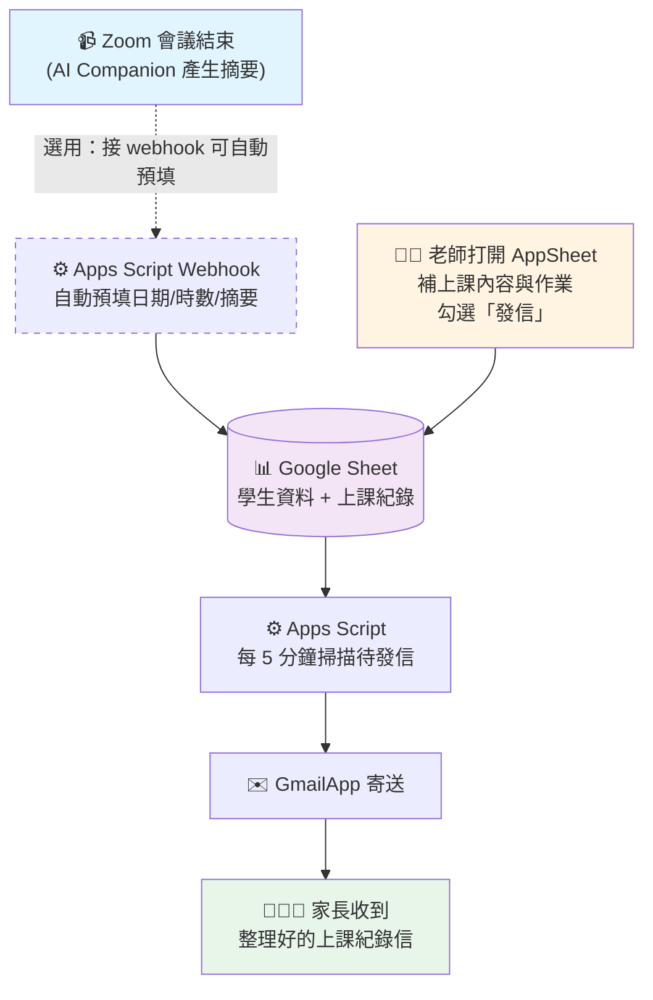

# 上課進度表 使用手冊

每次跟學生上完 Zoom 之後，用手機或電腦打開 AppSheet，填一下今天教了什麼、勾選「發信」、儲存。幾分鐘後，家長就會自動收到一封整理好的上課紀錄 email。

就這麼簡單。

## 它是怎麼運作的



**整條流程有兩個「寫入 Google Sheet」的入口**：
- **老師手動填**（一定會用到）：透過 AppSheet App 填表
- **Webhook 自動預填**（選用）：Zoom 會議結束自動補上日期、時數、AI 摘要連結

**一個「寄信」的出口**：老師在 AppSheet 勾選「發信」後，每 5 分鐘一次的排程會自動把信寄給對應家長。

---

## 開始之前，你需要準備

- 一個 Google 帳號（一般 Gmail 就可以，公司 / 學校 Workspace 更好）
- 一支可以上 Zoom 的手機或電腦
- AppSheet 帳號（等一下會直接用你的 Google 帳號登入，免費）

---

## 第 0 步：把工具裝起來（只做一次）

> 這步會用到電腦的「終端機」。聽起來很可怕，其實只是把下面的指令複製貼上，按 Enter 就好。如果真的沒辦法，請找工程師朋友幫忙跑這一節，後面的步驟你自己都做得來。

### 0-1. 開啟終端機

- **Mac**：按 `⌘ + 空白鍵` 打開 Spotlight → 輸入 `terminal` → Enter
- **Windows**：開始選單搜尋 `PowerShell` → 打開它

### 0-2. 裝 Node.js

Node.js 是讓下一步的 `clasp` 工具能跑起來的底層環境。

**Mac 最簡單的方法**（建議先裝 Homebrew，已裝跳過）：

```bash
# 先裝 Homebrew（已裝跳過）
/bin/bash -c "$(curl -fsSL https://raw.githubusercontent.com/Homebrew/install/HEAD/install.sh)"

# 再裝 Node.js
brew install node
```

**Windows**：到 <https://nodejs.org/> 下載「**LTS**」版本，一路下一步安裝即可。

裝完在終端機輸入 `node -v`，看到 `v20.x.x` 之類的版本號就代表 OK。

### 0-3. 裝 clasp（Google 官方的 Apps Script 命令列工具）

```bash
npm install -g @google/clasp
```

裝完輸入 `clasp --version`，看到版本號（例如 `3.0.6`）就 OK。

> 如果跳出 `permission denied` 錯誤：Mac 改成 `sudo npm install -g @google/clasp`（會要輸入你登入電腦的密碼）；Windows 改用「以系統管理員身份執行」打開 PowerShell 再跑一次。

### 0-4. 用 Google 帳號登入 clasp

```bash
clasp login
```

瀏覽器會自動彈出 Google 登入頁 → 選你要用的帳號（**和要存上課資料的 Google 帳號要是同一個**）→ 一路「允許」→ 回到終端機看到 `Authorization successful` 就成功了。

### 0-5. 把這個專案下載下來並推上你的 Apps Script

```bash
# 挑個你喜歡的資料夾，例如桌面
cd ~/Desktop

# 下載專案
git clone https://github.com/dairui1/gs-lesson-progress.git
cd gs-lesson-progress

# 安裝專案相依套件（其實只會裝 clasp 的版本鎖定，很快）
npm install

# 在你的 Google 帳號裡建立一個新的 Apps Script 專案
clasp create --type standalone --title "上課進度表" --rootDir ./src

# ⚠️ 重要：上一步會把 src/appsscript.json 覆蓋成預設版本，
# 所以再跑一次 push 把我們準備好的版本推上去
clasp push

# 打開 Apps Script 編輯器
clasp open-script
```

> 如果 `git clone` 那行跳出 `git: command not found`：Mac 終端機輸入 `xcode-select --install` 安裝；Windows 到 <https://git-scm.com/> 下載 Git for Windows。

> 執行 `clasp push` 時如果它問「Manifest file has been updated. Do you want to push and overwrite?」請輸入 `y` 然後 Enter。

瀏覽器應該會自動打開 **Apps Script 編輯器**頁面。**接下來所有步驟都在網頁上做，不用再碰終端機**。

---

## 第 1 步：按一次「初始化」

在 Apps Script 編輯器裡：

1. 上方中間有一個下拉選單（預設可能寫著 `doGet`），**把它改成 `initMasterSpreadsheet`**
2. 點旁邊的 ▶ **執行** 按鈕
3. **第一次執行會跳出授權視窗**：
   - 選擇你的 Google 帳號
   - 如果畫面寫「Google 尚未驗證這個應用程式」，點左下角「**進階**」→ 再點「**前往「上課進度表」（不安全）**」
   - 勾選全部權限 → 點「**允許**」
4. 回到編輯器，等個幾秒，下方「執行記錄」會出現一行像這樣的訊息：
   ```
   Master ready: https://docs.google.com/spreadsheets/d/xxxxx/edit
   ```
5. **把這條 URL 點開**，你就看到一份全新的 Google Sheet，裡面有三個分頁：
   - `學生資料`
   - `上課紀錄`
   - `Log`（系統記錄用，不用管它）

完成！這份 Sheet 就是所有資料存放的家。**建議現在就把它加到你的 Google Drive 書籤**。

---

## 第 2 步：（選填）幫寄件人改個名字

家長收到的 email 預設寄件人顯示「老師」兩個字。如果想改成你的名字：

1. 回到 Apps Script 編輯器 → 左側齒輪圖示 ⚙ **專案設定**
2. 往下捲，找到「**指令碼屬性**」→ 點「**新增指令碼屬性**」
3. 屬性名稱填 `EMAIL_SENDER_NAME`、值填例如 `王老師`
4. 點「儲存指令碼屬性」

想讓每封給家長的信都副本一份到你的信箱留檔？
- 再新增一個屬性，名稱 `EMAIL_CC`，值填你的 email

---

## 第 3 步：加入第一位學生

回到你在第 1 步打開的那份 Google Sheet：

1. 最上方的功能表列會多出一個 **「老師工具」**（如果沒看到，按 F5 重新整理頁面）
2. 點「**老師工具 → 新增學生**」
3. 依序跳出三個視窗，填：
   - 學生姓名（例如：小明）
   - 家長 email（例如：parent@gmail.com）
   - Zoom Meeting ID（可以先填 `0`，之後要接 Zoom 自動填欄再補）
4. 看到「已新增：小明（S001）」就成功了

重複這一步把其他學生加進去。你會看到「學生資料」分頁多出一列一列。

---

## 第 4 步：在 AppSheet 建立 App

AppSheet 是你上課後拿來填表的 UI（手機、平板、電腦都能用）。

1. 打開 <https://www.appsheet.com/> → 點右上角「**Sign In**」→ 用你的 Google 帳號登入（**要和剛剛 Sheet 同一個帳號**）
2. 點「**+ Create**」→ 選「**App**」→ 選「**Start with existing data**」
3. 取個 App 名字（例如「上課進度」）→ 點「**Choose your data**」→ 在 Google Drive 裡找到剛剛的 `上課進度 Master（老師）`
4. AppSheet 會花個十幾秒自動生成一個 App

生成好之後，需要再稍微調整三個地方：

### （1）確認 Tables

左側選單點 **Data**。你應該看到三張表：`學生資料`、`上課紀錄`、`Log`。
- `Log` 那張不需要給老師看，點右邊垃圾桶圖示移除它（不會刪 Google Sheet 裡的資料，只是 App 裡不顯示）

### （2）設定 Key 欄位

一樣在 Data：
- 點開 `學生資料` → 在 `student_id` 那列右側的勾勾打上 **Key**
- 點開 `上課紀錄` → 在 `lesson_id` 那列右側打上 **Key**

### （3）設定幾個重要欄位型別

點開 `上課紀錄`：

| 欄位 | Type 要選 |
|---|---|
| `student_id` | **Ref**（Source table 選 `學生資料`） |
| `日期` | **DateTime** |
| `上課時數(hr)` | **Decimal** |
| `發信` | **Yes/No** |
| `EmailSent` | **Yes/No** |
| `學生姓名` | **Text** |
| `家長email` | **Email** |
| `作業` / `上課內容` / `學習狀況/建議(會議摘要)` | **LongText** |

右上角按 **Save**。

### （4）試試看手機版

右上角有個 📱 圖示，點它可以預覽手機畫面。填個測試紀錄確認能存。

---

## 第 5 步：寄一封測試信給自己

1. 在 AppSheet 打開「上課紀錄」→ 點右下角的「**+**」新增一列
2. 選剛剛加的測試學生
3. **把「家長email」暫時改成你自己的信箱**（測試用，不要嚇到真的家長）
4. 填日期、上課時數、上課內容、作業，內容隨便打
5. **勾起「發信」那個開關**
6. 點右上角 **Save**

接下來兩種方式都可以：

- **方式 A（等 5 分鐘）**：系統每 5 分鐘自動掃一次，時間到會寄出。
- **方式 B（立刻寄）**：回到 Google Sheet →「**老師工具 → 立即掃描並寄送待發 Email**」。

你應該會在自己信箱看到一封排版好的上課紀錄信。把剛剛的測試資料刪掉，正式上線。

---

## 每天怎麼用

下課之後（大概花你 1 分鐘）：

1. 看一眼 Zoom 的 AI 摘要（如果有 Zoom Pro）
2. 打開 AppSheet → 「上課紀錄」→「+」
3. **選學生**（家長 email 會自動帶入）
4. 填：**日期、上課時數、上課內容、作業**
5. 想附上 AI 摘要的話，把 Zoom 摘要連結貼到「學習狀況/建議(會議摘要)」欄位
6. **勾選「發信」→ 儲存**

搞定。幾分鐘內家長會收到信。

---

## 常見問題

### 我勾了「發信」但家長沒收到

先回 Google Sheet 打開「上課紀錄」，找那一列，**往右邊看 `ErrorMessage` 欄位有沒有字**。最常見兩種：

- **「家長email 欄位為空或格式錯誤」** → 去改掉
- **超過 Gmail 每日額度** → 免費 Gmail 每天上限 100 封；一般老師不會超過。如果是共用帳號同時跑很多事，可能要隔天再試

### 寄完了，想重新寄給家長

在「上課紀錄」那一列：
- 把 `EmailSent` 改回 FALSE（或清空）
- 確認「發信」還是勾選的
- 下一次掃描（最多 5 分鐘）會重送

### 家長 email 換了

直接在「學生資料」分頁改。**以後的紀錄**會用新的 email；舊的紀錄仍保留當時的值（可以當作歷史存檔）。如果想讓舊的也跟著更新，直接在「上課紀錄」那一列把 email 手動改掉即可。

### 收件人顯示是我的 Gmail，可以改成機構信箱嗎？

免費版只能顯示你登入的那個 Gmail。如果你有 Google Workspace，可以在 Gmail **設定 → 帳戶 → 新增「Send mail as」**加別名，之後寫信就可以選別名當寄件人。

### 不小心把一列刪掉了

- 若是「學生資料」：手動補一列，格式照其他列填（student_id 照 `S001、S002...` 的規則續號）
- 若是「上課紀錄」：如果只是 AppSheet 把它標為 deleted，AppSheet → Data → 該 table → **Undelete** 找回來

### 我想暫停自動寄信

- Apps Script 編輯器 → 左側 ⏰ **觸發條件** → 找到 `sendPendingEmails` → 點三個點 → **刪除觸發條件**
- 想恢復：執行一次 `initMasterSpreadsheet` 就會重新裝好

---

## 進階：接 Zoom Webhook（選做）

如果你用 **Zoom Pro + AI Companion**，可以讓系統更懶：

- 每堂課結束時，日期、上課時數、Zoom 會議主題自動填好
- AI 摘要完成時，摘要連結和 AI 建議的作業自動帶入
- 你只要開 AppSheet 看一眼、補上「上課內容」、勾選發信即可

以下設定步驟比較技術化，**建議交給工程師一次設定好**。設定完你完全不用理它，每天只是少打幾個欄位而已。

### A. 在 Apps Script 把程式「部署」成對外網址

Zoom 要有一個能 POST 的網址才能把事件送過來，這個網址是由 Apps Script 的 **Web App Deployment** 提供。

1. 本機執行：
   ```bash
   clasp push
   clasp deploy --description "v1"
   ```
2. 完成後，指令會印出類似：
   ```
   - abcdef123...456 @1
   - https://script.google.com/macros/s/AKfyc.../exec
   ```
   **把那條 `/exec` 結尾的網址複製下來**，這就是 Zoom 要送事件過去的地方。
3. 回到 Master Sheet →「**老師工具 → 顯示 Webhook 設定資訊**」，會看到一組 URL token（英數字串）。
4. 最終 Zoom 要填的完整 URL 是：
   ```
   <剛剛的 /exec 網址>?token=<URL token>
   ```
   例如：`https://script.google.com/macros/s/AKfyc.../exec?token=abc123def456`

### B. 在 Zoom Marketplace 建一個 Webhook App

1. 打開 <https://marketplace.zoom.us/develop/create>，用你的 Zoom Pro 帳號登入
2. 選 **General App**（或舊版的 **Webhook Only**）→ **Create**
3. 進到 App 設定頁，左側切到 **Feature**
4. 找到「**Event Subscriptions**」→ 打開開關 → 點「**Add Event Subscription**」
5. 填：
   - **Subscription Name**：隨便取，例如 `Lesson Progress`
   - **Event notification endpoint URL**：貼上第 A 步算出來的完整 URL（含 `?token=...`）
   - **Event types**：點「**Add events**」→ 找到並勾選：
     - **Meeting** → **End Meeting**
     - **Meeting** → **All Recordings have completed**（如果你要錄影的摘要）
     - **Meeting** → **Summary completed**（AI Companion 摘要完成時）
6. 回到同一頁最上方，可以看到 **Secret Token**（Zoom 幫你產的那串），**把它複製下來**
7. 點頁面下方的 **Validate** 按鈕：
   - 如果綠色打勾，代表 CRC 驗證通過
   - 如果紅色，通常是 Secret Token 還沒填進 Apps Script（繼續下一步後再回來按 Validate）

### C. 把 Zoom Secret Token 填進 Apps Script

1. 回到 Apps Script 編輯器 → 左側齒輪 ⚙ **專案設定**
2. 下方「**指令碼屬性**」→「**新增指令碼屬性**」
3. 屬性名稱填 `ZOOM_WEBHOOK_SECRET`、值貼上剛剛 Zoom 給的 Secret Token
4. 儲存
5. 回到 Zoom Marketplace 那頁，再按一次 **Validate** → 應該會變綠色打勾
6. 頁面最下方 **Save** → 然後左側「**Activation**」→ 啟用 App

### D. 把學生的 Zoom Meeting ID 填進去

系統怎麼知道這場會議是哪位學生的？靠「學生資料」分頁的 `zoom_meeting_id` 欄位。

1. 打開 Zoom → 你給這位學生用的會議（可以是你的個人會議室 PMI，也可以是固定排定的 recurring meeting）
2. 複製那串 **Meeting ID**（通常是 10-11 位數字，例如 `923 4567 8900`）
3. 在「學生資料」分頁，找到對應學生那一列的 `zoom_meeting_id`，貼上（空格不空格都可以，系統會自動清理）
4. 每位學生都這樣做一次

> 小技巧：如果你習慣為每位學生使用固定 Zoom 會議（每週同一個連結），這招最穩。如果每次都開臨時會議，就不適合接 webhook。

### E. 測試

1. 跟測試學生開一場短的 Zoom 會議，結束它
2. 回到 Google Sheet 的「**Log**」分頁：
   - 如果看到 `lesson_ended` + 學生名字 = 成功
   - 如果看到 `unknown_meeting` = 學生資料的 `zoom_meeting_id` 沒對上，檢查數字是否正確
   - 如果什麼都沒看到 = Zoom 那邊事件沒送出，回 Zoom Marketplace 檢查事件訂閱有沒有打開
3. 看「上課紀錄」分頁 → 應該多出一列，日期、時數、Zoom 主題、Meeting UUID 都自動填好了
4. 如果有啟用 AI Companion 摘要，大概 1–5 分鐘後會再次更新該列，多出摘要連結和建議作業

### F. 之後如果改了 Apps Script 程式碼

- 一般的程式修改：`clasp push` 即可，部署會自動跟著生效
- 只有改到 `appsscript.json`（例如新增 scope）時：要執行 `clasp update-deployment <deploymentId> --description "vN"` 更新既有部署；`deploymentId` 可用 `clasp list-deployments` 查

### 常見狀況

- **Zoom Validate 失敗**：9 成是 `ZOOM_WEBHOOK_SECRET` 沒設、設錯、或 Apps Script 沒部署。回 Master Sheet「老師工具 → 顯示 Webhook 設定資訊」再確認一次網址與 token 格式。
- **事件有收到但沒更新任何資料**：Log 分頁看 `unknown_meeting` 或 `unauthorized`。前者是學生對不上，後者是網址少了 `?token=`。
- **AI 摘要欄位一直空著**：Zoom 要 Pro + AI Companion 有開，且老師或主持人在會議中按過 AI 摘要。沒按就不會有 summary_completed 事件。

---

## 給工程師的技術備註

- 資料結構：`src/Config.js` 的 `STUDENTS_HEADERS` 與 `LESSONS_HEADERS` 為準；`上課紀錄` 為單一表（AppSheet 資料源），以 `lesson_id` 為 key、`Meeting UUID` 作為 webhook upsert 比對鍵。
- 寄信：`src/Email.js`，每 5 分鐘時間觸發器；使用 `GmailApp`，每日額度：免費 Gmail 100、Workspace 1500。
- Webhook（選用）：`src/Webhook.js` 處理 `meeting.summary_completed`（主）+ `meeting.ended`（fallback）。因 Apps Script `doPost(e)` 無法讀 HTTP header，簽章驗證改用 URL query token（Zoom endpoint 填 `<EXEC_URL>?token=<ZOOM_URL_TOKEN>`）。
- Script Properties：
  - `MASTER_SPREADSHEET_ID`（自動）
  - `ZOOM_URL_TOKEN`（自動產生）
  - `ZOOM_WEBHOOK_SECRET`（手動填；僅 webhook 需要）
  - `EMAIL_SENDER_NAME`（選填，預設「老師」）
  - `EMAIL_CC`（選填）
- 指令：
  ```bash
  npm run push      # clasp push
  npm run deploy    # clasp deploy --description "v1"（僅 webhook 需要）
  npm run open      # 開 Apps Script 編輯器（clasp open-script）
  npm run logs      # clasp logs
  ```
